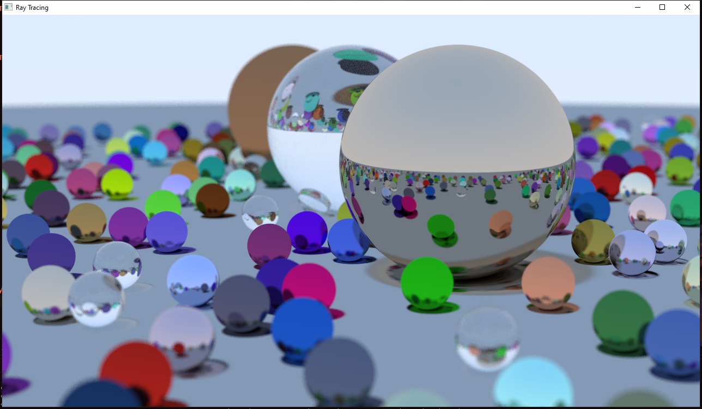

# ZW_Raytracing

这是一个基于 CPU 的离线光线追踪渲染器，参考 [Ray Tracing in One Weekend](https://github.com/RayTracing/raytracing.github.io/) 写成。

相比与原书的实现方式，Zw_Raytracing 进行了如下特性的改进：

- 使用多线程加速渲染，使得渲染器在多核 CPU 的前提下渲染速度大幅提升
- 更加直观的渲染结果，使用 GLFW 作为渲染结果的输出窗口替代输出到 .ppm 文件中
- 更加清晰的场景的场景管理，封装一个类进行专门的场景管理和存储渲染结果
- 实时显式渲染进度和渲染时间

渲染结果示例：

